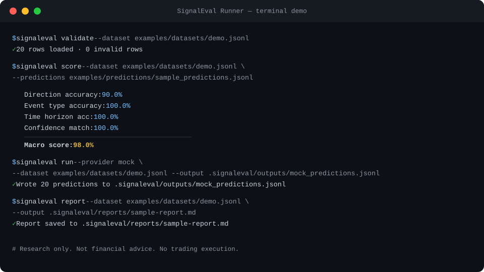

# SignalEval Runner by Catalayer

**Run financial news-to-signal benchmarks across LLM providers, local models, and custom prediction files.**

---

Most AI models can summarize market news. Fewer can turn news into structured, testable market signals.

SignalEval Runner is a lightweight CLI for evaluating whether language models can convert market-moving news into structured signal predictions: direction, event type, time horizon, confidence, and reasoning.

It is designed to work with News2SignalBench-style datasets and can evaluate predictions from local files, mock runs, local models via Ollama, and optional cloud provider integrations.

> **Research only. Not financial advice. No trading execution.**

---



---

## Table of Contents

1. [What is SignalEval Runner?](#what-is-signaleval-runner)
2. [Why this exists](#why-this-exists)
3. [How it fits with News2SignalBench](#how-it-fits-with-news2signalbench)
4. [Quick Start](#quick-start)
5. [Dataset format](#dataset-format)
6. [Prediction format](#prediction-format)
7. [Commands](#commands)
8. [Providers](#providers)
9. [Metrics](#metrics)
10. [Example report](#example-report)
11. [Roadmap](#roadmap)
12. [Important limitations](#important-limitations)
13. [License](#license)

---

## What is SignalEval Runner?

SignalEval Runner answers one question:

> **Can a model read market-moving news and output structured signal labels — direction, event type, asset relevance, time horizon, confidence, and reasoning?**

It provides a clean evaluation loop:

```
dataset (JSONL) → provider → predictions (JSONL) → scorer → report (Markdown)
```

You can evaluate any prediction source:
- Pre-generated prediction files
- Local models running on Ollama
- OpenAI models (optional, requires API key)
- Anthropic models (optional, requires API key)
- Deterministic mock predictions for testing

---

## Why this exists

Most LLM benchmarks measure general knowledge or reasoning. Financial signal extraction is a different capability — it requires:

- Understanding event type classification (earnings, central bank, geopolitics, etc.)
- Mapping news to directional market impact (bullish, bearish, neutral, mixed)
- Estimating confidence and time horizon
- Providing traceable reasoning

No lightweight, provider-agnostic, open-source runner existed for this task. SignalEval Runner fills that gap.

---

## How it fits with News2SignalBench

| Component | Role |
|-----------|------|
| **News2SignalBench** | Defines the benchmark dataset format and labeling standard |
| **SignalEval Runner** | Runs model evaluations, scores predictions, generates reports |
| **Catalayer AI Mini 500M** | A model that can be evaluated through this runner |

SignalEval Runner is compatible with any dataset that follows the News2SignalBench JSONL schema.

---

## Quick Start

```bash
# Clone and install
git clone https://github.com/stephenywilson/SignalEvalRunner
cd SignalEvalRunner

python3 -m venv .venv
source .venv/bin/activate
pip install -e .

# Verify
signaleval --help
signaleval providers

# Initialize config
signaleval init

# Validate the demo dataset
signaleval validate --dataset examples/datasets/demo.jsonl

# Score pre-made sample predictions
signaleval score \
  --dataset examples/datasets/demo.jsonl \
  --predictions examples/predictions/sample_predictions.jsonl

# Generate a report
signaleval report \
  --dataset examples/datasets/demo.jsonl \
  --predictions examples/predictions/sample_predictions.jsonl \
  --output .signaleval/reports/sample-report.md

# Run mock provider (no API key needed)
signaleval run \
  --dataset examples/datasets/demo.jsonl \
  --provider mock \
  --output .signaleval/outputs/mock_predictions.jsonl

# Run the full pre-release check (no external API calls)
bash scripts/check_release.sh
```

---

## Dataset format

Datasets are JSONL files — one JSON object per line.

### Required fields

| Field | Type | Allowed values |
|-------|------|---------------|
| `id` | string | Any unique string |
| `headline` | string | News headline |
| `body` | string | News body text |
| `asset` | string | Asset ticker or name |
| `asset_type` | string | `stock`, `etf`, `crypto`, `commodity`, `bond`, etc. |
| `event_type` | string | See event types below |
| `expected_direction` | string | `bullish`, `bearish`, `neutral`, `mixed` |
| `time_horizon` | string | `intraday`, `short_term`, `medium_term`, `long_term` |
| `confidence_label` | string | `low`, `medium`, `high` |
| `rationale` | string | Human explanation for the label |

### Event types

`central_bank` · `earnings` · `guidance` · `inflation` · `jobs` · `geopolitics` · `regulation` · `merger` · `product_launch` · `supply_chain` · `credit` · `commodity` · `crypto` · `other`

### Example row

```json
{
  "id": "demo_001",
  "headline": "Federal Reserve holds rates steady, signals two cuts in 2025",
  "body": "The FOMC voted unanimously to hold the benchmark rate at 5.25-5.50%...",
  "asset": "SPY",
  "asset_type": "etf",
  "event_type": "central_bank",
  "expected_direction": "bullish",
  "time_horizon": "short_term",
  "confidence_label": "high",
  "rationale": "Dovish Fed pivot signal reduces discount rate pressure on equities."
}
```

Full schema: [`schema/news_signal_dataset.schema.json`](schema/news_signal_dataset.schema.json)

---

## Prediction format

Predictions are also JSONL files — one prediction per line, matched to dataset rows by `id`.

### Required fields

| Field | Type | Allowed values |
|-------|------|---------------|
| `id` | string | Must match a dataset row id |
| `predicted_direction` | string | `bullish`, `bearish`, `neutral`, `mixed` |
| `predicted_event_type` | string | See event types above |
| `predicted_time_horizon` | string | `intraday`, `short_term`, `medium_term`, `long_term` |
| `predicted_confidence` | string | `low`, `medium`, `high` |
| `reasoning` | string | Model's one-sentence explanation |

### Optional fields

`predicted_asset` · `model` · `provider` · `raw_output`

### Example row

```json
{
  "id": "demo_001",
  "predicted_direction": "bullish",
  "predicted_event_type": "central_bank",
  "predicted_time_horizon": "short_term",
  "predicted_confidence": "high",
  "reasoning": "Dovish tone and rate cut signal reduces rate risk for equities.",
  "model": "gpt-4o-mini",
  "provider": "openai"
}
```

Full schema: [`schema/news_signal_prediction.schema.json`](schema/news_signal_prediction.schema.json)

---

## Commands

### `signaleval init`

Initialize the local config and output directories.

```bash
signaleval init          # Creates .signaleval/config.json, outputs/, reports/
signaleval init --force  # Overwrite existing config
```

---

### `signaleval validate`

Validate a dataset JSONL file.

```bash
signaleval validate --dataset examples/datasets/demo.jsonl
```

Checks:
- Required fields present and non-empty
- Allowed label values for direction, time horizon, confidence, event type
- Prints row count and any validation errors
- Exits non-zero if invalid rows exist

---

### `signaleval run`

Run a provider against a dataset and write predictions to JSONL.

```bash
signaleval run \
  --dataset examples/datasets/demo.jsonl \
  --provider mock \
  --output .signaleval/outputs/mock_predictions.jsonl

# With file provider
signaleval run \
  --dataset examples/datasets/demo.jsonl \
  --provider file \
  --predictions-file examples/predictions/sample_predictions.jsonl \
  --output .signaleval/outputs/file_run.jsonl

# With Ollama (requires local Ollama server)
signaleval run \
  --dataset examples/datasets/demo.jsonl \
  --provider ollama \
  --model llama3 \
  --output .signaleval/outputs/llama3_predictions.jsonl

# With OpenAI (requires OPENAI_API_KEY)
export OPENAI_API_KEY=your_key
signaleval run \
  --dataset examples/datasets/demo.jsonl \
  --provider openai \
  --model gpt-4o-mini \
  --output .signaleval/outputs/openai_predictions.jsonl
```

---

### `signaleval score`

Score predictions against ground truth.

```bash
signaleval score \
  --dataset examples/datasets/demo.jsonl \
  --predictions examples/predictions/sample_predictions.jsonl

# Also write metrics as JSON
signaleval score \
  --dataset examples/datasets/demo.jsonl \
  --predictions examples/predictions/sample_predictions.jsonl \
  --json-output .signaleval/outputs/metrics.json
```

---

### `signaleval report`

Generate a Markdown evaluation report.

```bash
signaleval report \
  --dataset examples/datasets/demo.jsonl \
  --predictions examples/predictions/sample_predictions.jsonl \
  --output .signaleval/reports/my-report.md
```

---

### `signaleval providers`

List available providers and their requirements.

```bash
signaleval providers
```

---

## Providers

| Provider | API key required | Description |
|----------|-----------------|-------------|
| `mock` | No | Deterministic fake predictions — safe for CI and demos |
| `file` | No | Read predictions from an existing JSONL file |
| `ollama` | No (local) | Local model inference via Ollama |
| `openai` | Yes (`OPENAI_API_KEY`) | OpenAI chat completions |
| `anthropic` | Yes (`ANTHROPIC_API_KEY`) | Anthropic Messages API |

**External providers are entirely optional.** All smoke tests and demos use `mock` or `file` providers only.

API keys are read from environment variables only. They are never stored, logged, or printed.

See [`docs/providers.md`](docs/providers.md) for full setup instructions.

---

## Metrics

All v0.1 metrics use exact-match scoring.

| Metric | Description |
|--------|-------------|
| Direction accuracy | Exact match: `expected_direction` vs `predicted_direction` |
| Event type accuracy | Exact match: `event_type` vs `predicted_event_type` |
| Time horizon accuracy | Exact match: `time_horizon` vs `predicted_time_horizon` |
| Confidence match | Exact match: `confidence_label` vs `predicted_confidence` |
| Coverage | % of dataset rows with a matching prediction by id |
| Macro score | Mean of all 5 metrics above |
| Invalid predictions | Count of predictions with missing fields or invalid labels |

See [`docs/evaluation-metrics.md`](docs/evaluation-metrics.md) for full explanation and limitations.

---

## Example report

Running `sample_predictions.jsonl` against the demo dataset:

```
SignalEval Score Summary
========================================
Dataset rows:         20
Prediction rows:      20
Matched rows:         20
Coverage:             100.0%
Invalid predictions:  0
---
Direction accuracy:   90.0%
Event type accuracy:  100.0%
Time horizon acc:     100.0%
Confidence match:     100.0%
---
Macro score:          98.0%
```

Running `imperfect_predictions.jsonl` against the same dataset:

```
Direction accuracy:   20.0%
Event type accuracy:  90.0%
Time horizon acc:     40.0%
Confidence match:     15.0%
Macro score:          53.0%
```

A pre-generated Markdown report is included at [`examples/reports/sample-report.md`](examples/reports/sample-report.md).

---

## Static Board Export

SignalEvalRunner can generate a local HTML leaderboard from evaluation result JSON files:

```bash
signaleval board --input examples/runs --output site-demo
```

The generated site is fully static and can be opened locally (`open site-demo/index.html`) or deployed to GitHub Pages.

See [`docs/board.md`](docs/board.md) for the full input format reference and deployment guide.

---

## Roadmap

### v0.3 (planned)

- Partial credit scoring for adjacent labels (`bullish` vs `mixed` = 0.5)
- Reasoning quality scoring via judge model
- Per-event-type metric breakdown
- Confidence calibration analysis
- Asset prediction accuracy metric
- CSV output for score command
- Batch run support

### Future

- Catalayer AI Mini 500M evaluation integration
- Multi-dataset comparison runs

---

## Important limitations

- **Research only.** This tool evaluates model output quality. It does not measure real-world trading performance.
- **Not financial advice.** No content in this repository constitutes investment advice or trading recommendations.
- **No trading execution.** This tool has no connection to any trading system or brokerage.
- **Board is static.** The board generated by `signaleval board` is a static snapshot. Adding new runs requires regenerating the site.
- **Reasoning not scored.** Reasoning text is captured but not graded. Grading reasoning reliably requires human labels or a judge model — planned for v0.3.
- **Exact match only.** Partial credit scoring for adjacent labels is planned for v0.2.
- **Synthetic demo data.** The included dataset is entirely synthetic. It does not require or contain private News2SignalBench data. Real evaluation requires domain-appropriate labeled data.
- **External providers are optional.** Using OpenAI or Anthropic providers requires your own API key. Smoke tests and the release check never call external APIs.
- **API keys are never stored.** Keys are read from environment variables only and are never written to config files, output files, or logs.
- **News2SignalBench compatibility.** SignalEval Runner works with any dataset following the News2SignalBench JSONL schema. It does not depend on or require access to private News2SignalBench datasets.

---

## License

Apache-2.0 — see [LICENSE](LICENSE).

© 2024-2026 Catalayer AI

---

*SignalEval Runner is part of the Catalayer AI research ecosystem.*
